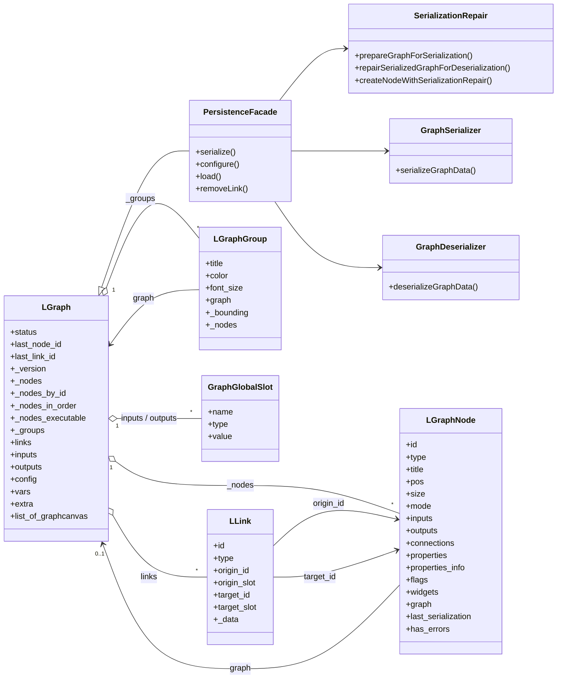
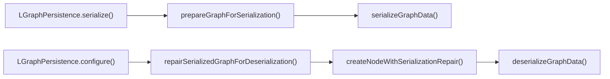

# Architecture Data Model

本文档描述当前代码里的真实领域模型与持久化形态，重点覆盖：

- `LGraph / LGraphNode / LLink / LGraphGroup`
- Graph 全局 IO 容器
- 当前 persistence 管线
- 运行态与序列化态之间的边界

## 1. 核心实体图



---

## 2. 容器、所有权与 ID 规则

### 2.1 Graph 的核心容器

`LGraph` 同时维护多套容器：

- `_nodes`: 节点顺序数组
- `_nodes_by_id`: `id -> node` 索引表，实际按字符串 key 使用
- `_nodes_in_order`: 当前执行序缓存
- `_nodes_executable`: 只包含 `onExecute` 节点的执行缓存
- `_groups`: 分组数组
- `links`: `id -> link` 映射表，实际也按字符串 key 使用
- `list_of_graphcanvas`: 已附着到当前 graph 的画布列表

### 2.2 节点与连线 ID

默认情况下：

- 节点 ID 来自 `graph.last_node_id`
- 连线 ID 来自 `graph.last_link_id`

当 `LiteGraph.use_uuids === true` 时：

- 节点 ID 会改为 `uuidv4()`
- 连线 ID 也会改为 `uuidv4()`

这点非常重要，因为当前某些类型声明仍然偏向 `number`，但运行时已经允许字符串 UUID。

### 2.3 Group 的所有权

`LGraphGroup` 存在于 graph 的 `_groups` 中，并在 `graph.add(group)` 时建立反向 `group.graph = graph`。  
分组本身不持有复杂链接关系，它通过 `recomputeInsideNodes()` 动态计算包围盒内的节点集合。

---

## 3. Node / Slot / Link 的结构约束

### 3.1 Node 输入输出槽

当前实现遵循：

- 输入槽：`link: number | null`
  - 一个输入槽最多只连一条边
- 输出槽：`links: number[] | null`
  - 一个输出槽可以连多条边
- 输出槽运行时还可能带 `_data`
  - 用于缓存最近一次输出值
  - 该字段会在 `serialize()` 前被清掉

### 3.2 Node 的其他重要状态

`LGraphNode` 除输入输出外还持有：

- `connections`
  - 用于特殊位置的连接点，不等价于 `inputs/outputs`
- `properties` 与 `properties_info`
- `widgets`
- `flags`
- `graph`
- `graph_version`
- `last_serialization`
- `has_errors`

`last_serialization + has_errors` 用在反序列化 fallback 场景：当节点类型不存在时，会退化成普通 `LGraphNode` 占位，并保留原始序列化数据。

### 3.3 Link 的结构

`LLink` 是 graph 中边的运行时实体，核心字段是：

- `id`
- `type`
- `origin_id`
- `origin_slot`
- `target_id`
- `target_slot`

运行期附加字段：

- `_data`
- `_pos`
- 某些调用路径会给 link 对象附加 `_last_time`

### 3.4 移除槽位时的索引修正

`removeInput()` 与 `removeOutput()` 并不是只删数组项。它们还会同步修正：

- link 的 `target_slot`
- link 的 `origin_slot`

这是为了避免槽位删除后，历史连线指向错位。

---

## 4. Graph 全局 IO 的数据形态

Graph 级别输入输出并不是节点槽，而是对象映射：

```ts
inputs[name] = { name, type, value }
outputs[name] = { name, type, value }
```

相关 API 位于 `LGraph.io-events.ts`：

- `addInput / removeInput / renameInput / changeInputType`
- `setInputData / getInputData`
- `addOutput / removeOutput / renameOutput / changeOutputType`
- `setOutputData / getOutputData`

需要注意：

- 这些 graph 级 IO 当前存在于运行时模型里
- 但 `serializeGraphData()` 当前并不会把 `inputs/outputs` 写入最终 graph JSON

也就是说，graph 全局 IO 元数据目前是运行时/editor 状态，不是完整持久化快照的一部分。

---

## 5. 运行态与序列化态的边界

### 5.1 Graph

当前 `serializeGraphData()` 输出的 graph 外层字段只有：

```ts
{
  last_node_id,
  last_link_id,
  nodes,
  links,
  groups,
  config,
  extra,
  version
}
```

不会被当前 serializer 写出的字段包括：

- `status`
- `_version`
- `_nodes_in_order`
- `_nodes_executable`
- `list_of_graphcanvas`
- `vars`
- `inputs`
- `outputs`
- 时间统计字段
- 执行中的标记数组

### 5.2 Node

`LGraphNode.serialize()` 当前会输出：

- `id`
- `type`
- `pos`
- `size`
- `flags`
- `order`
- `mode`
- `inputs`
- `outputs`
- `title`，仅当与类默认标题不同
- `properties`
- `widgets_values`，前提是 `serialize_widgets === true`
- `color / bgcolor / boxcolor / shape`

特殊规则：

- 若节点是 fallback 的普通 `LGraphNode` 且带 `last_serialization`，会直接返回 `last_serialization`
- 输出槽的 `_data` 会在序列化前被删除

### 5.3 Link

运行时 `LLink.serialize()` 输出的是 runtime 顺序的 tuple：

```ts
[id, origin_id, origin_slot, target_id, target_slot, type]
```

但 compat 层同时支持 d.ts 顺序：

```ts
[id, type, origin_id, origin_slot, target_id, target_slot]
```

### 5.4 Group

`LGraphGroup.serialize()` 当前输出：

```ts
{
  title,
  bounding,
  color,
  font_size
}
```

compat 层会兼容历史上的 `font` 字段输入。

---

## 6. 当前 persistence 管线

当前图持久化已经不是单文件黑盒，而是 4 段式管线：



### 6.1 序列化前修补

`prepareGraphForSerialization()` 会：

- 遍历 `graph.links`
- 遇到“像 link 但不是 `LLink` 实例”的对象时，尝试修补成真正的 `LLink`
- 返回修补后的 links 列表和 warning

### 6.2 纯序列化

`serializeGraphData()` 只负责：

- `nodes.map(node.serialize())`
- `links.map(link.serialize())`
- `groups.map(group.serialize())`

这里不承担兼容 if-else。

### 6.3 反序列化前修补

`repairSerializedGraphForDeserialization()` 会：

- 接受 `links` 为数组或对象表两种输入
- 跳过空 link
- 归一化成 `nodes[] / links[] / groups[] / extra`

### 6.4 节点创建修补

`createNodeWithSerializationRepair()` 先尝试：

- `host.createNode(type, title)`

若失败：

- 回退为 `new LGraphNode()`
- 标记 `has_errors = true`
- 保存 `last_serialization`

### 6.5 纯反序列化

`deserializeGraphData()` 的顺序是：

1. 先回填 graph 标量字段
2. 重建所有 `links`
3. `target.add(node, true)` 把节点放入 graph
4. 第二轮 `node.configure(nodeData)` 恢复节点内部状态
5. 重建 groups
6. `updateExecutionOrder()`
7. 触发 `onConfigure`
8. `setDirtyCanvas(true, true)`

这个“两阶段节点恢复”是当前反序列化的重要事实。

---

## 7. 数据模型上的兼容点

### 7.1 Link tuple 顺序

- d.ts：`[id, type, origin_id, origin_slot, target_id, target_slot]`
- runtime：`[id, origin_id, origin_slot, target_id, target_slot, type]`

统一由：

- `models/LLink.serialization.compat.ts`
- `compat/compat-runtime.ts`

处理。

### 7.2 Group 字段名

- d.ts / 历史接口：`font`
- runtime：`font_size`

统一由：

- `models/LGraphGroup.serialization.compat.ts`

处理。

### 7.3 Graph 钩子

`onNodeAdded` 的实际调用点已被集中到：

- `models/LGraph.hooks.ts`

避免钩子判断散落在业务代码里。

---

## 8. 关键源码

- `src/ts-migration/models/LGraph.lifecycle.ts`
- `src/ts-migration/models/LGraph.structure.ts`
- `src/ts-migration/models/LGraph.io-events.ts`
- `src/ts-migration/models/LGraph.persistence.ts`
- `src/ts-migration/models/LGraphNode.state.ts`
- `src/ts-migration/models/LGraphNode.execution.ts`
- `src/ts-migration/models/LGraphNode.ports-widgets.ts`
- `src/ts-migration/models/LGraphNode.connect-geometry.ts`
- `src/ts-migration/models/LGraphNode.canvas-collab.ts`
- `src/ts-migration/models/LLink.ts`
- `src/ts-migration/models/LGraphGroup.ts`
- `src/ts-migration/models/serialization-repair.ts`
- `src/ts-migration/models/graph-serializer.ts`
- `src/ts-migration/models/graph-deserializer.ts`
