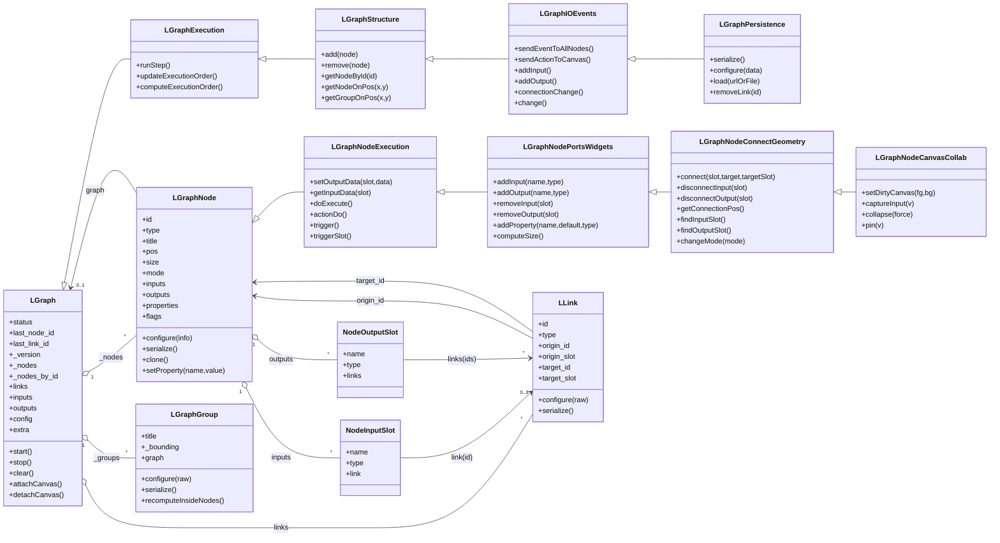

# Architecture Data Model

## 核心 UML 类图（Graph / Node / Link）

## 属性与关系映射

### 1) Graph 如何管理 Nodes 与 Links
- 图对象同时维护三套核心容器：`_nodes`（顺序列表）、`_nodes_by_id`（ID 索引）、`links`（边映射）。
- `LGraphStructure.add()` 负责分配节点 ID、写入 `_nodes/_nodes_by_id`、触发执行序更新与脏标记。
- `LGraphStructure.remove()` 会先断开节点所有输入输出，再从 `_nodes/_nodes_by_id` 移除，并同步画布选中状态。
- 实际连线创建与删除在节点侧完成：`LGraphNodeConnectGeometry.connect()/disconnectInput()/disconnectOutput()` 直接读写 `graph.links`，并同步输入槽 `link` 与输出槽 `links`。
- `LGraphPersistence.removeLink()` 通过目标节点 `disconnectInput()` 间接回收 link，保证数据结构一致。

### 2) Node 如何管理 Inputs 与 Outputs
- 输入端口结构：`INodeInputSlot`，核心字段是 `link: NodeLinkId | null`（单入边）。
- 输出端口结构：`INodeOutputSlot`，核心字段是 `links: NodeLinkId[] | null`（多出边）。
- `LGraphNodePortsWidgets.addInput()/addOutput()` 负责端口创建、尺寸重算、类型注册、脏标记。
- `removeInput()/removeOutput()` 在删槽后会回写 link 的 `target_slot/origin_slot` 索引，避免槽位偏移导致错连。
- `LGraphNodeConnectGeometry.changeMode()` 会按模式自动补齐触发端口（如 `onTrigger` 输入、`onExecuted` 输出）。

## 状态管理与序列化

### 1) 状态存储（State）
- Graph 持久状态：
  - 结构：`_nodes/_nodes_by_id/links/_groups`
  - 全局 IO：`inputs/outputs`
  - 配置：`config/extra/vars`
  - 版本：`_version`
- Graph 运行态：
  - `status/execution_timer_id`
  - 调度缓存：`_nodes_in_order/_nodes_executable`
  - 计时：`globaltime/runningtime/fixedtime/elapsed_time`
- Node 持久状态：
  - 标识与布局：`id/type/title/pos/size`
  - 行为：`mode/flags`
  - 端口：`inputs/outputs`
  - 数据：`properties/widgets_values`
- Link 状态：
  - `id/type/origin_id/origin_slot/target_id/target_slot`
  - 运行期附加：`data/_last_time`

### 2) 序列化与反序列化关键方法
- Graph：
  - `LGraphPersistence.serialize()`：汇总 `nodes[].serialize()`、`link.serialize()`、`group.serialize()` 并输出 graph 快照。
  - `LGraphPersistence.configure(data)`：先还原 links，再创建节点并二次 `node.configure(...)`，最后还原 groups。
  - `LGraphPersistence.load(url|File|Blob)`：读取 JSON 后调用 `configure()`。
- Node：
  - `LGraphNode.serialize()`：导出节点基础字段、端口、属性、样式、widgets 值。
  - `LGraphNode.configure(info)`：回填字段、重建端口连接关系回调、恢复 widgets 与属性。
  - `LGraphNode.clone()`：`serialize -> 清空 links -> configure` 的克隆路径。
- Link：
  - `LLink.serialize()`：输出 tuple 结构。
  - `LLink.configure(raw)`：兼容不同 tuple 次序输入并归一化到内部字段。
- Group：
  - `LGraphGroup.serialize()/configure()`：独立保存与恢复分组边界与样式。

### 3) JSON 形态（领域层）
- Graph 外层：`{ last_node_id, last_link_id, nodes, links, groups, config, extra, version }`
- Node 元素：`{ id, type, pos, size, flags, mode, inputs, outputs, title, properties, widgets_values }`
- Link 元素：tuple（运行时与 d.ts 顺序通过 `LLink.configure` 兼容）

## 关键源码（领域模型）
- [LGraph.lifecycle.ts](/E:/Code/litegraph.js/src/ts-migration/models/LGraph.lifecycle.ts)
- [LGraph.execution.ts](/E:/Code/litegraph.js/src/ts-migration/models/LGraph.execution.ts)
- [LGraph.structure.ts](/E:/Code/litegraph.js/src/ts-migration/models/LGraph.structure.ts)
- [LGraph.io-events.ts](/E:/Code/litegraph.js/src/ts-migration/models/LGraph.io-events.ts)
- [LGraph.persistence.ts](/E:/Code/litegraph.js/src/ts-migration/models/LGraph.persistence.ts)
- [LGraphNode.state.ts](/E:/Code/litegraph.js/src/ts-migration/models/LGraphNode.state.ts)
- [LGraphNode.execution.ts](/E:/Code/litegraph.js/src/ts-migration/models/LGraphNode.execution.ts)
- [LGraphNode.ports-widgets.ts](/E:/Code/litegraph.js/src/ts-migration/models/LGraphNode.ports-widgets.ts)
- [LGraphNode.connect-geometry.ts](/E:/Code/litegraph.js/src/ts-migration/models/LGraphNode.connect-geometry.ts)
- [LGraphNode.canvas-collab.ts](/E:/Code/litegraph.js/src/ts-migration/models/LGraphNode.canvas-collab.ts)
- [LLink.ts](/E:/Code/litegraph.js/src/ts-migration/models/LLink.ts)
- [LGraphGroup.ts](/E:/Code/litegraph.js/src/ts-migration/models/LGraphGroup.ts)
- [serialization.ts](/E:/Code/litegraph.js/src/ts-migration/types/serialization.ts)
