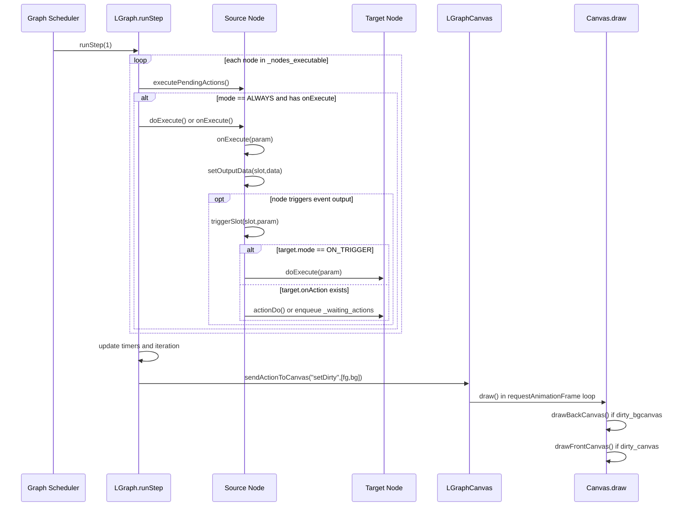

# Architecture Execution Flow

## 1. 节点生命周期（Node Lifecycle）

以下按“创建 -> 入图 -> 连接 -> 执行 -> 变更同步 -> 序列化 -> 销毁”梳理标准节点路径。

### 1.1 创建阶段
- 类型注册：`LiteGraphRegistry.registerNodeType(type, baseClass)`，把节点类注册进 `registered_node_types`。
- 实例创建：`LiteGraphRegistry.createNode(type, title, options)`。
  - 调用构造函数 `new baseClass(title)`。
  - 初始化默认字段：`type/title/properties/properties_info/flags/size/pos/mode`。
  - 触发创建钩子：`node.onNodeCreated?.()`。

### 1.2 添加到图（Attach to Graph）
- `LGraphStructure.add(node)`：
  - 分配/校正 `id`，挂载 `node.graph = this`。
  - 写入图容器：`_nodes` 与 `_nodes_by_id`。
  - 回调：`node.onAdded?.(graph)`。
  - 更新执行序：`updateExecutionOrder()`（可跳过）。
  - 图级钩子：`graph.onNodeAdded`（通过兼容 hook 调用）。
  - 标记画布脏区并触发变更：`setDirtyCanvas()/change()`。

### 1.3 连接与断开（Wiring）
- 建立连接：`LGraphNodeConnectGeometry.connect(...)`
  - 校验槽位与类型兼容（`isValidConnection`）。
  - 触发节点连接前钩子：
    - `target.onBeforeConnectInput?.(...)`
    - `target.onConnectInput?.(...)`
    - `source.onConnectOutput?.(...)`
  - 写入 link：
    - `graph.links[link.id] = link`
    - `output.links.push(link.id)`
    - `input.link = link.id`
  - 回调链：
    - `source.onConnectionsChange(...)`
    - `target.onConnectionsChange(...)`
    - `graph.onNodeConnectionChange(...)`
    - `graph.connectionChange(...)`（内部会 `updateExecutionOrder()`）
- 断开连接：`disconnectInput()/disconnectOutput()`
  - 回收 `graph.links`、清理输入输出槽 link 信息。
  - 同步触发 `onConnectionsChange` 与 `graph.connectionChange`。

### 1.4 执行阶段
- 主执行循环（图级）：`LGraphExecution.runStep(...)`。
  - 迭代 `_nodes_executable`（由执行序构建）。
  - 每个节点先执行 `executePendingActions()`（处理延迟 action）。
  - `mode == ALWAYS` 且存在 `onExecute` 时执行节点计算。
- 节点执行封装（节点级）：`LGraphNodeExecution.doExecute(...)`
  - 维护执行态标记：`nodes_executing/nodes_executedAction/exec_version`。
  - 调用用户逻辑：`onExecute(...)`。
  - 收尾钩子：`onAfterExecuteNode?.(...)`。
- 事件触发链：`trigger()/triggerSlot()`
  - 遍历 EVENT 输出槽关联 link。
  - 目标节点若 `mode == ON_TRIGGER`，走 `target.doExecute(...)`。
  - 否则走 `target.actionDo(...)` 或延迟入队 `_waiting_actions`（`use_deferred_actions`）。

### 1.5 图/画布同步阶段
- 结构或连接变更后，图会 `sendActionToCanvas("setDirty", [fg,bg])`。
- 画布在渲染循环里读取脏标记并执行 `drawBackCanvas()/drawFrontCanvas()`。

### 1.6 序列化与恢复
- 节点：
  - `LGraphNode.serialize()`：导出 `id/type/pos/size/flags/mode/inputs/outputs/properties/widgets_values/...`。
  - `LGraphNode.configure(info)`：回填字段，恢复端口、属性、widgets，并触发 `onConfigure`。
- 图：
  - `LGraphPersistence.serialize()`：收集所有 `nodes/links/groups/config/extra/version`。
  - `LGraphPersistence.configure(data)`：先重建 links，再创建并配置节点，最后重建 groups。

### 1.7 销毁阶段
- `LGraphStructure.remove(node)`：
  - `beforeChange()`
  - 断开全部输入/输出连接
  - 节点销毁钩子：`node.onRemoved?.()`
  - 从 `_nodes/_nodes_by_id` 删除，更新执行序，`afterChange()/change()`。
- 图清空：`LGraph.clear()` 会对所有节点调用 `onRemoved` 并重置容器。

---

## 2. 执行拓扑（Execution Order）

## 结论
- 主循环不是简单遍历，也不是纯数据驱动；是**拓扑排序 + 事件驱动混合模型**。

## 2.1 拓扑排序主路径
- `LGraphExecution.computeExecutionOrder(only_onExecute?, set_level?)` 采用 Kahn 风格流程：
  1. 统计每个节点“剩余入边数”（来自 `inputs[].link`）。
  2. 入边为 0 的节点进入起始队列 `S`。
  3. 从 `S` 逐个弹出，遍历其输出 links，减少目标节点剩余入边数。
  4. 剩余入边变 0 的目标节点入队。
  5. 队列结束后，把未处理节点（环路）追加到结果末尾。
  6. 按 `priority` 二次排序并回写 `order`。
- `updateExecutionOrder()` 会把有 `onExecute` 的节点提取到 `_nodes_executable`。

## 2.2 事件驱动补充路径
- `triggerSlot()` 对 EVENT 连线目标：
  - `ON_TRIGGER` 节点直接执行 `doExecute()`。
  - `onAction` 节点执行 `actionDo()`，或在启用 `use_deferred_actions` 时延迟到下个 `runStep` 处理。

---

## 3. 渲染与计算分离（Decoupling）

## 结论
- **计算循环**与**渲染循环**是解耦的，两者通过“脏标记 + 图状态”协同。

### 3.1 计算循环
- 由 `LGraph.start()` 驱动，调用 `runStep()`。
- 管理节点执行、时间推进与执行状态缓存。

### 3.2 渲染循环
- 由 `LGraphCanvasLifecycle.startRendering()` 驱动（`requestAnimationFrame`）。
- 每帧调用 `draw()`：
  - `dirty_bgcanvas` 条件满足时绘制背景与连线层。
  - `dirty_canvas` 条件满足时绘制前景节点层。

### 3.3 协同机制
- 结构/连接/属性变化时，图通过 `sendActionToCanvas("setDirty", ...)` 通知画布。
- 节点触发事件会更新 `graph._last_trigger_time`，渲染层可利用该时间窗做视觉反馈（例如 link 高亮时效）。

---

## 4. 一步执行时序图（One Step Sequence）

---

## 5. 关键实现位置

- [LGraph.lifecycle.ts](/E:/Code/litegraph.js/src/ts-migration/models/LGraph.lifecycle.ts)
- [LGraph.execution.ts](/E:/Code/litegraph.js/src/ts-migration/models/LGraph.execution.ts)
- [LGraph.structure.ts](/E:/Code/litegraph.js/src/ts-migration/models/LGraph.structure.ts)
- [LGraph.io-events.ts](/E:/Code/litegraph.js/src/ts-migration/models/LGraph.io-events.ts)
- [LGraph.persistence.ts](/E:/Code/litegraph.js/src/ts-migration/models/LGraph.persistence.ts)
- [LGraphNode.execution.ts](/E:/Code/litegraph.js/src/ts-migration/models/LGraphNode.execution.ts)
- [LGraphNode.connect-geometry.ts](/E:/Code/litegraph.js/src/ts-migration/models/LGraphNode.connect-geometry.ts)
- [LGraphCanvas.lifecycle.ts](/E:/Code/litegraph.js/src/ts-migration/canvas/LGraphCanvas.lifecycle.ts)
- [LGraphCanvas.render.ts](/E:/Code/litegraph.js/src/ts-migration/canvas/LGraphCanvas.render.ts)
- [litegraph.registry.ts](/E:/Code/litegraph.js/src/ts-migration/core/litegraph.registry.ts)
