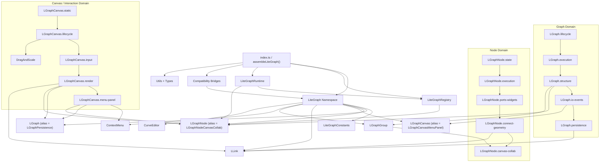

# Architecture Overview (TS Migration)

## 1. 模块职责划分

### A. 装配与入口层（Composition / Entry）
- `src/ts-migration/index.ts`
- 职责：
  - 聚合核心类导出（`LGraph / LGraphNode / LLink / LGraphCanvas / ContextMenu`）
  - 创建 `LiteGraph` 命名空间（常量 + 注册/运行时 API + 工具函数）
  - 注入 host（`*.liteGraph`）到 Graph/Node/Canvas/UI 分层类
  - 暴露装配入口 `assembleLiteGraph(options)`
  - 输出默认装配实例 `defaultAssembly`（并导出 `LiteGraph / registry / runtime`）

### B. 核心元数据与工厂层（Core）
- `core/litegraph.constants.ts`
- `core/litegraph.registry.ts`
- `core/litegraph.runtime.ts`
- 职责：
  - 常量与全局行为参数（执行模式、形状、连接语义等）
  - 节点类型注册/反注册/创建工厂
  - 运行时能力：slot 类型注册、函数包装节点、连接兼容、文件加载等

### C. 图模型层（Graph Domain）
- 链路：`LGraph.lifecycle -> LGraph.execution -> LGraph.structure -> LGraph.io-events -> LGraph.persistence`
- 职责：
  - 图生命周期（start/stop/attachCanvas/clear）
  - 执行调度与拓扑排序
  - 节点/分组的增删查与结构管理
  - 全局输入输出与图级事件分发
  - 图序列化/反序列化与加载恢复

### D. 节点模型层（Node Domain）
- 链路：`LGraphNode.state -> LGraphNode.execution -> LGraphNode.ports-widgets -> LGraphNode.connect-geometry -> LGraphNode.canvas-collab`
- 职责：
  - 节点基础状态与配置
  - 输入输出数据流、trigger/action 执行
  - 端口与 widgets 管理
  - 连线几何、连接/断开与模式切换
  - 与画布协作（脏区刷新、输入捕获、局部坐标转屏幕坐标）

### E. 连接与分组模型（Link / Group）
- `models/LLink.ts`
- `models/LGraphGroup.ts`
- 职责：
  - `LLink`: 边数据结构及序列化形态
  - `LGraphGroup`: 分组边界、分组内节点计算、分组序列化

### F. 画布与交互层（Canvas/UI Engine）
- 链路：`LGraphCanvas.static -> LGraphCanvas.lifecycle -> LGraphCanvas.input -> LGraphCanvas.render -> LGraphCanvas.menu-panel`
- 关联：`canvas/DragAndScale.ts`
- 职责：
  - 静态菜单能力与全局 active 状态
  - Canvas 生命周期/事件绑定/子图切换
  - 鼠标/触摸/键盘输入处理
  - 前后景渲染、节点绘制、连线绘制
  - 上下文菜单、搜索框、属性面板、对话框

### G. 独立 UI 组件层（UI Widgets）
- `ui/ContextMenu.ts`
- `ui/CurveEditor.ts`
- 职责：
  - 通用上下文菜单（菜单树、关闭策略、事件透传）
  - 曲线编辑器（点编辑、采样、绘制）

### H. 兼容桥接层（Compatibility）
- `compat/global-bridge.ts`
- `compat/cjs-exports.ts`
- `ui/context-menu-compat.ts`
- `canvas/LGraphCanvas.static.compat.ts`
- 职责：
  - 兼容旧 IIFE/全局挂载与 CommonJS 导出
  - 对旧 API 别名和历史行为进行桥接

### I. 类型与工具层（Types / Utils）
- `types/*.ts`
- `utils/*.ts`
- 职责：
  - 核心类型、序列化类型、兼容类型定义
  - 数学、颜色、函数签名、clamp 等通用能力

---

## 2. 全局依赖关系图

---

## 3. 入口与单例说明

### 3.1 全局入口点（Entry Point）
- 代码入口：`src/ts-migration/index.ts`
- 核心装配函数：`assembleLiteGraph(options?: LiteGraphAssemblyOptions): LiteGraphAssembly`
- 装配流程：
  1. `createLiteGraphNamespace()` 生成 `LiteGraph` 命名空间
  2. 创建 `LiteGraphRegistry` 与 `LiteGraphRuntime`
  3. 将 host 注入 Graph/Node/Canvas/UI 分层类
  4. 视选项挂接到 `globalThis` 或 CommonJS `exports`

### 3.2 默认实例（模块级“单例态”）
- `index.ts` 在模块加载时执行：
  - `const defaultAssembly = assembleLiteGraph()`
  - `export const LiteGraph = defaultAssembly.LiteGraph`
  - `export const registry = defaultAssembly.registry`
  - `export const runtime = defaultAssembly.runtime`
- 这组导出在单次模块上下文内是默认共享实例（工程实践上可视为默认单例）。

### 3.3 显式全局状态（Static Shared State）
- `LGraphCanvas.active_canvas`
- `LGraphCanvas.active_node`
- 属于跨实例共享的静态状态位，用于菜单回调和当前交互上下文定位。

### 3.4 结论
- 架构并非“只能一个实例”的硬单例设计：可以多次调用 `assembleLiteGraph()` 构建多个装配体。
- 但默认导出路径确实提供了“默认单例装配”（`LiteGraph / registry / runtime`），同时 Canvas 存在静态共享交互状态。
