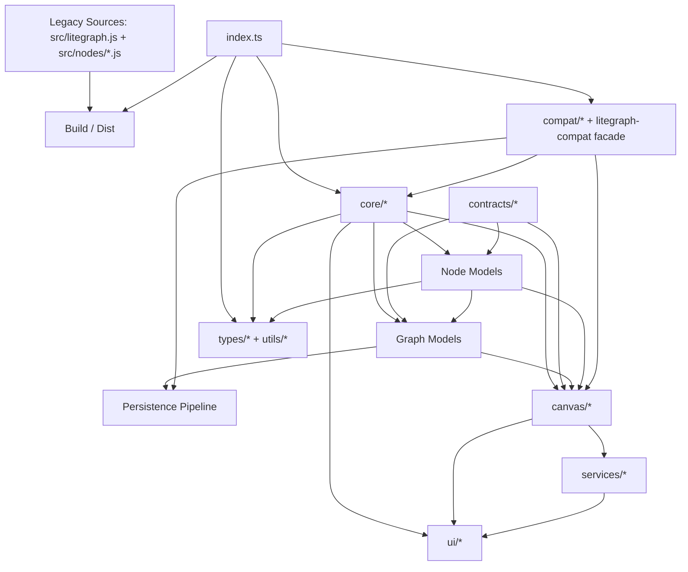

# Architecture Overview

本文档描述当前仓库的真实架构，而不是只描述历史上的单文件 `litegraph.js`，也不是只描述理想化的 TS 迁移目标。

当前仓库实际上并存三套东西：

- 旧版运行时源码：`src/litegraph.js` 与 `src/nodes/*.js`
- 当前主架构实现：`src/ts-migration/**`
- 发布与打包出口：`dist/**`、`package.json`、`scripts/build-*.mjs`

下面的分层说明以 `src/ts-migration/**` 为主，因为这已经是仓库里最清晰、最系统的架构表达；同时会指出它与 legacy/runtime 产物之间的关系。

## 1. 仓库级分层

### A. 交付与兼容入口层

- `package.json`
- `scripts/build-dist.mjs`
- `scripts/build-ts-migration.mjs`
- `dist/litegraph.core.js`
- `dist/litegraph.basic.js`
- `dist/litegraph.extended.js`
- 职责：
  - 定义对外包入口与 CSS 导出
  - 产出 legacy 风格的分发包
  - 保留旧运行时的加载/分发方式

### B. Legacy Runtime 层

- `src/litegraph.js`
- `src/nodes/*.js`
- 职责：
  - 旧版单文件核心实现与内置节点族
  - 仍然是 dist 构建的重要输入
  - 与 TS 迁移层共享相同的 `LiteGraph.registerNodeType(...)` 契约

### C. 装配入口层

- `src/ts-migration/index.ts`
- 职责：
  - 暴露 `assembleLiteGraph(options)`
  - 组装默认装配体并导出 `LiteGraph / registry / runtime / liteGraphMigrationBundle`
  - 统一调用 assembly compat 与可选 bridge

### D. Core 层

- `src/ts-migration/core/host-resolver.ts`
- `src/ts-migration/core/litegraph.constants.ts`
- `src/ts-migration/core/litegraph.constants.compat.ts`
- `src/ts-migration/core/litegraph.namespace.ts`
- `src/ts-migration/core/litegraph.registry.ts`
- `src/ts-migration/core/litegraph.runtime.ts`
- 职责：
  - 定义 `LiteGraph` 常量与运行开关
  - 构建命名空间与 class host
  - 提供节点注册、创建、slot 类型注册、函数包装、搜索扩展、文件加载等能力

### E. Contracts 层

- `src/ts-migration/contracts/canvas.ts`
- `src/ts-migration/contracts/ui.ts`
- 职责：
  - 为 `models -> canvas/ui` 之间提供最小依赖面
  - 避免图模型直接依赖具体 DOM/UI 实现

### F. Graph / Node 领域模型层

- Graph 链：
  - `models/LGraph.lifecycle.ts`
  - `models/LGraph.execution.ts`
  - `models/LGraph.structure.ts`
  - `models/LGraph.io-events.ts`
  - `models/LGraph.persistence.ts`
- Node 链：
  - `models/LGraphNode.state.ts`
  - `models/LGraphNode.execution.ts`
  - `models/LGraphNode.ports-widgets.ts`
  - `models/LGraphNode.connect-geometry.ts`
  - `models/LGraphNode.canvas-collab.ts`
- 其他模型：
  - `models/LLink.ts`
  - `models/LGraphGroup.ts`
  - `models/LGraph.hooks.ts`
- 职责：
  - 图、节点、分组、连线的核心数据结构与行为
  - 执行调度、连接管理、图级事件、画布协作

### G. Persistence 管线层

- `models/serialization-repair.ts`
- `models/graph-serializer.ts`
- `models/graph-deserializer.ts`
- `models/graph-persistence.types.ts`
- 职责：
  - 在 `LGraph.persistence.ts` 之外单独完成
    - 序列化前修补
    - 纯序列化
    - 反序列化前修补
    - 纯反序列化
  - 把历史兼容逻辑从图模型本体里拆出去

### H. Canvas 交互层

- `canvas/DragAndScale.ts`
- `canvas/LGraphCanvas.static.ts`
- `canvas/LGraphCanvas.static.compat.ts`
- `canvas/LGraphCanvas.lifecycle.ts`
- `canvas/LGraphCanvas.input.ts`
- `canvas/LGraphCanvas.render.ts`
- `canvas/LGraphCanvas.menu-panel.ts`
- 职责：
  - 维护画布静态菜单资源、生命周期、输入处理、渲染循环
  - `menu-panel` 只保留薄调度，低频 UI 逻辑已下沉到 `services/`

### I. UI / Service 层

- `ui/ContextMenu.ts`
- `ui/CurveEditor.ts`
- `ui/context-menu-compat.ts`
- `services/*.ts`
- 职责：
  - 独立 UI 组件
  - 右键菜单、面板、对话框、搜索框、子图 IO 面板、浮层基础设施
  - 将低频 DOM 逻辑从 `LGraphCanvas` 主类中剥离

### J. Compat / Facade 层

- `compat/compat-schema.ts`
- `compat/compat-runtime.ts`
- `compat/litegraph-assembly-compat.ts`
- `compat/litegraph-assembly-bridges.ts`
- `compat/global-bridge.ts`
- `compat/cjs-exports.ts`
- `compat/pointer-events.ts`
- `compat/time-source.ts`
- `types/litegraph-compat.ts`
- `types/litegraph-compat.d.ts`
- 职责：
  - 建立 compat 的单一真相
  - 处理常量别名、Canvas 静态/实例 shim、序列化字段差异、全局桥接、CommonJS 导出

### K. Types / Utils 层

- `types/core-types.ts`
- `types/serialization.ts`
- `utils/*.ts`
- 职责：
  - 定义节点/连线/序列化类型
  - 提供颜色、几何、函数签名、clamp 等纯工具能力

---

## 2. 全局依赖图



---

## 3. 入口装配路径

### 3.1 `assembleLiteGraph(options)`

当前装配链路是：

1. `createLiteGraphNamespace()`
   - 以 `LiteGraphConstants` 为底座创建命名空间
   - 创建 `LiteGraphRegistry`
   - 创建 `LiteGraphRuntime`
   - 把 registry/runtime API 挂到 `LiteGraph`
   - 把 `liteGraph` host 绑定回 Graph/Node/Canvas/UI 类
2. `createAssemblyBundle(...)`
   - 产出 `LiteGraph / LGraph / LGraphNode / LLink / LGraphCanvas / ContextMenu / CurveEditor / registry / runtime`
3. `applyLiteGraphAssemblyCompat(bundle)`
   - 调用 compat runtime，把 assembly 级别的 alias/shim 一次性打到 bundle 上
4. `attachLiteGraphAssemblyBridges(bundle, options)`
   - 按需挂到 `globalThis`
   - 按需挂到 CommonJS `exports`

### 3.2 默认导出

`index.ts` 在模块加载时执行：

```ts
const defaultAssembly = assembleLiteGraph();

export const LiteGraph = defaultAssembly.LiteGraph;
export const registry = defaultAssembly.registry;
export const runtime = defaultAssembly.runtime;
export const liteGraphMigrationBundle = defaultAssembly;
```

这意味着：

- 模块默认导入路径提供了一个“默认装配体”
- 但架构本身并不是硬单例，仍然可以多次调用 `assembleLiteGraph()` 创建隔离实例

---

## 4. 共享状态与实例模型

### 4.1 模块级默认共享实例

- `LiteGraph`
- `registry`
- `runtime`
- `liteGraphMigrationBundle`

它们在一次模块加载上下文里默认共享。

### 4.2 Canvas 静态共享状态

`LGraphCanvas` 上存在跨实例共享状态与缓存：

- `LGraphCanvas.active_canvas`
- `LGraphCanvas.active_node`
- `LGraphCanvas.link_type_colors`
- `LGraphCanvas.node_colors`
- `LGraphCanvas.gradients`

这些是菜单回调、配色和渲染缓存的重要共享面。

### 4.3 Graph / Node 实例态

- `LGraph` 负责图级容器、执行调度、全局 IO、序列化与 attached canvases
- `LGraphNode` 负责节点自身状态、端口、widgets、连接、执行、画布协作
- `LLink` 与 `LGraphGroup` 是纯领域实体，不持有复杂外部依赖

---

## 5. 当前仓库需要特别注意的现实差异

### 5.1 TS 迁移层不是唯一运行时来源

仓库发布产物仍然依赖 legacy 源码与内置节点包，因此：

- `src/ts-migration/**` 是“主架构表达”
- `src/litegraph.js` 与 `src/nodes/*.js` 仍然是“现行交付链条的一部分”

### 5.2 compat 已经形成单一真相

新增兼容项时，推荐顺序应当是：

1. 改 `compat/compat-schema.ts`
2. 在 `compat/compat-runtime.ts` 补 runtime 行为
3. 必要时更新 façade 导出与文档

不要再把兼容逻辑散落回 model/canvas 主流程。

### 5.3 persistence 已经从 Facade 中拆开

`LGraph.persistence.ts` 现在只做 orchestration，不再承担全部细节。真正的数据恢复链路已经是：

- `serialization-repair`
- `graph-serializer`
- `graph-deserializer`
- `LGraph.persistence` façade

---

## 6. 建议阅读顺序

如果要从代码理解整个系统，建议顺序如下：

1. `src/ts-migration/index.ts`
2. `src/ts-migration/core/litegraph.namespace.ts`
3. `src/ts-migration/core/litegraph.registry.ts`
4. `src/ts-migration/core/litegraph.runtime.ts`
5. `src/ts-migration/models/LGraph.*`
6. `src/ts-migration/models/LGraphNode.*`
7. `src/ts-migration/models/serialization-repair.ts`
8. `src/ts-migration/models/graph-serializer.ts`
9. `src/ts-migration/models/graph-deserializer.ts`
10. `src/ts-migration/canvas/LGraphCanvas.*`
11. `src/ts-migration/services/*.ts`
12. `src/ts-migration/compat/*.ts`
