# LiteGraph 渲染机制与基础操作时序图

本文基于当前仓库源码分析 `litegraph.js` 的渲染与交互执行链，重点覆盖：

- 渲染主循环与前后景分层
- 图执行循环与渲染联动
- 编辑器基础操作（增删节点、连线、拖拽、缩放、复制粘贴、序列化）
- 子图（Subgraph）与节点控件（Widgets）交互

## 1. 范围与阅读方式

### 1.1 分析边界

- 分析对象：
  - `src/litegraph.js`
  - `src/litegraph-editor.js`
  - `editor/js/code.js`
- 目标：
  - 讲清“函数调用链 + 状态字段变化”
  - 给出可直接用于沟通/排障的时序图（Mermaid）
- 非目标：
  - 不修改运行时行为
  - 不给出重构方案

### 1.2 核心角色

- `LiteGraph`：全局注册中心与工厂（如 `registerNodeType`, `createNode`）
- `LGraph`：图运行时与数据容器（节点、连线、执行顺序）
- `LGraphNode`：节点基类（输入输出、执行、事件、连接）
- `LGraphCanvas`：Canvas 渲染器 + 交互控制器
- `DragAndScale`：视口平移/缩放变换状态
- `LiteGraph.Editor`：对 `LGraphCanvas` 的 UI 包装

### 1.3 快速定位入口

- `LGraphCanvas` 构造入口：`src/litegraph.js:5325`
- 渲染循环：`LGraphCanvas.startRendering` -> `draw`
- 执行循环：`LGraph.start` -> `runStep`
- 编辑器联动：`src/litegraph-editor.js:25` 的 `graph.onAfterExecute = () => graphcanvas.draw(true)`

## 2. 渲染系统总览

### 2.1 渲染管线概览

`LGraphCanvas` 使用“双层绘制”思路：

- 背景层（`drawBackCanvas`）：
  - 背景图案/网格
  - 分组（groups）
  - 连接线（connections）
- 前景层（`drawFrontCanvas`）：
  - 节点本体、标题、插槽、widgets
  - 当前拖拽中的临时连接线
  - 选框、提示层、子图 panel

调度入口在 `draw(force_canvas, force_bgcanvas)`：

1. 计算 `render_time/fps`
2. 计算 `visible_area`（`DragAndScale.computeVisibleArea`）
3. 判断是否需要重绘背景层（`dirty_bgcanvas` 或强制）
4. 判断是否需要重绘前景层（`dirty_canvas` 或强制）

### 2.2 关键状态字段

- `dirty_canvas`：前景是否脏
- `dirty_bgcanvas`：背景是否脏
- `visible_nodes`：当前可见节点缓存（用于渲染与命中）
- `visible_links`：当前可见连接缓存（用于连线中心点击等）
- `graph._last_trigger_time`：最近触发时间，用于触发态视觉高亮
- `editor_alpha/live_mode`：编辑态与 live 模式过渡
- `ds.scale/ds.offset`：缩放和平移变换状态

### 2.3 初始化与事件绑定

`LGraphCanvas` 构造中会：

1. 初始化 `DragAndScale`
2. 设置渲染行为开关与默认样式
3. `graph.attachCanvas(this)`（如果传入 graph）
4. `setCanvas(canvas)` 创建/绑定 `bgcanvas` 与 `ctx`
5. `clear()` 复位内部状态
6. `startRendering()` 启动 `requestAnimationFrame` 循环（可通过 `skip_render` 关闭）

## 3. 渲染分层与脏标记机制

### 3.1 脏标记来源

脏标记最终都通过 `LGraphCanvas.setDirty(fg, bg)` 或 `LGraph.change()` 触发：

- `LGraph.change()` -> `sendActionToCanvas("setDirty",[true,true])`
- 节点/连线增删改（`LGraph.add/remove`, `connect/disconnect`）会调用 `setDirtyCanvas`/`change`
- 鼠标交互（移动、拖拽、缩放）会在事件处理中直接设 `dirty_canvas/dirty_bgcanvas`

### 3.2 背景层 `drawBackCanvas`

主要步骤：

1. 对齐 `bgcanvas` 尺寸
2. 清理背景区域
3. 渲染 subgraph stack 标识边框（若在子图）
4. 执行背景回调 `onRenderBackground/onDrawBackground`
5. 应用 `ds.toCanvasContext(ctx)`（世界坐标变换）
6. 绘制背景图案（pattern）
7. 绘制 groups
8. 绘制连接线 `drawConnections`
9. `dirty_bgcanvas = false; dirty_canvas = true`（背景变化会强制前景重刷）

### 3.3 前景层 `drawFrontCanvas`

主要步骤：

1. `dirty_canvas = false`
2. 清理前景区域（可按 `viewport/dirty_area` clip）
3. 合成背景层（`ctx.drawImage(bgcanvas)`）
4. 绘制 overlay 信息（`renderInfo`）
5. 应用 `ds.toCanvasContext(ctx)`，计算可见节点并循环 `drawNode`
6. 按配置补绘连接线（`links_ontop`）
7. 绘制临时连接线（拖拽连线中）
8. 绘制选框、链接 tooltip、前景回调、subgraph panel

### 3.4 节点与连线绘制细节

- 节点：`drawNode`
  - 处理 `live_mode`、阴影、折叠态、shape、title、slots、widgets
- 连线：`drawConnections` -> `renderLink`
  - 从目标节点输入槽反查 `graph.links[link_id]`
  - 计算起终点 `getConnectionPos`
  - 根据 `links_render_mode`（spline/linear/straight）绘制
  - 触发态（`link._last_time`）做流动高亮

## 4. 执行循环与渲染联动

### 4.1 执行入口

- `LGraph.start(interval)`
  - `interval == 0`：`requestAnimationFrame` 驱动 `runStep`
  - 否则：`setInterval` 驱动 `runStep`
- 每次 step：
  - 可选 `onBeforeStep`
  - `runStep(1, ...)`
  - 可选 `onAfterStep`

### 4.2 `runStep` 核心行为

1. 更新时间戳（`globaltime`, `elapsed_time`）
2. 按 `_nodes_executable`（已排序）遍历
3. 对 `mode == LiteGraph.ALWAYS` 且有 `onExecute` 的节点执行：
   - catch 模式下直接 `node.onExecute()`
   - no-catch 模式下 `node.doExecute()`
4. 执行 deferred actions（`executePendingActions`）
5. 更新性能统计并清理执行态标记

### 4.3 执行与画布刷新衔接

在 `LiteGraph.Editor` 中，执行后显式触发前景重绘：

- `graph.onAfterExecute = function(){ graphcanvas.draw(true); }`

这意味着：

- 图可持续执行（逻辑 tick）
- 画布前景在每个执行步后立即刷新（尤其适用于 widget/数值显示）

## 5. 基础操作时序图（核心 + 子图 + 控件）

参与者统一为：`User`、`LGraphCanvas`、`LGraph`、`LGraphNode`、`DragAndScale`、`ContextMenu`。

### 5.1 渲染帧主循环

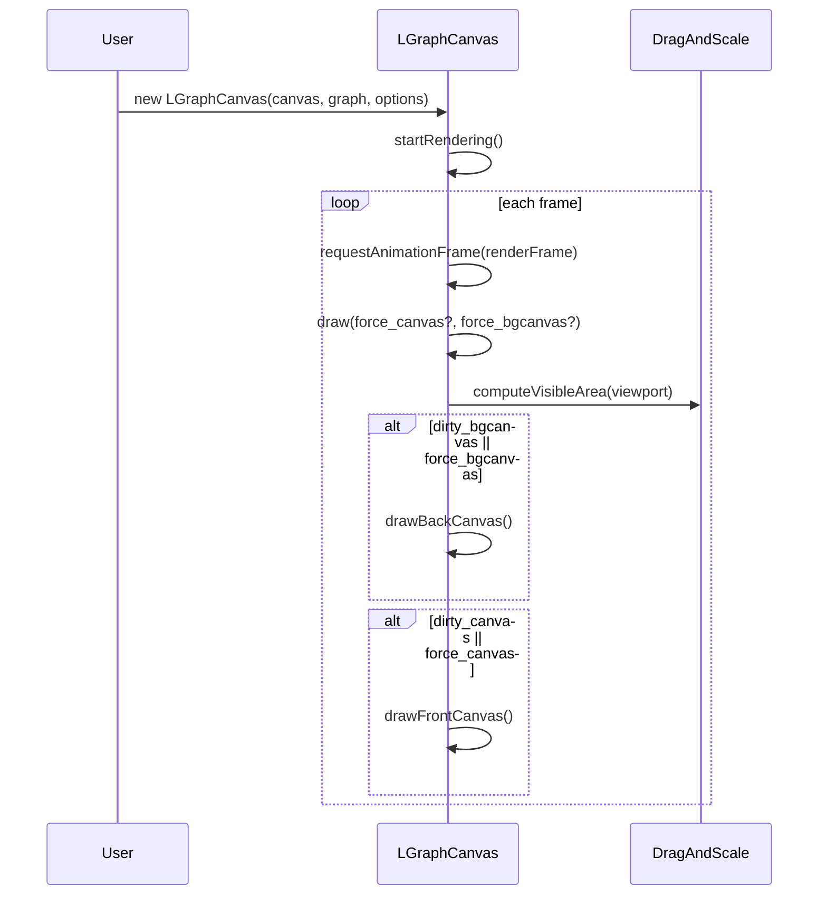

### 5.2 前后景分层渲染

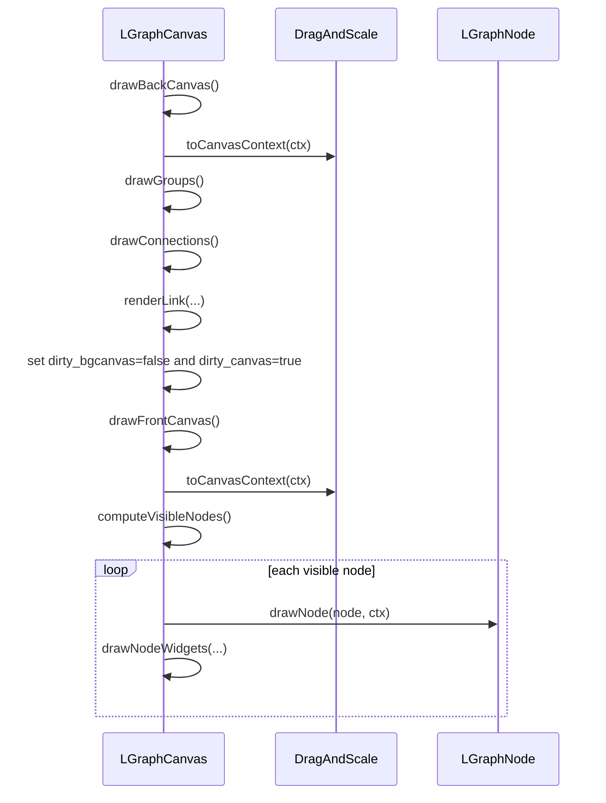

### 5.3 运行时执行联动刷新

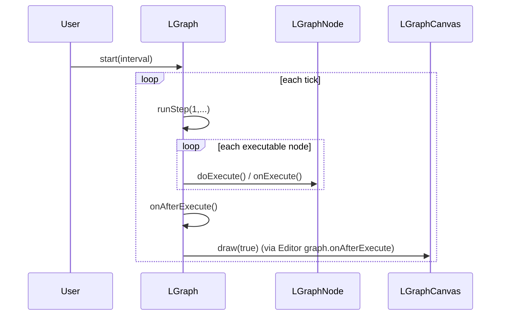

### 5.4 右键菜单新增节点

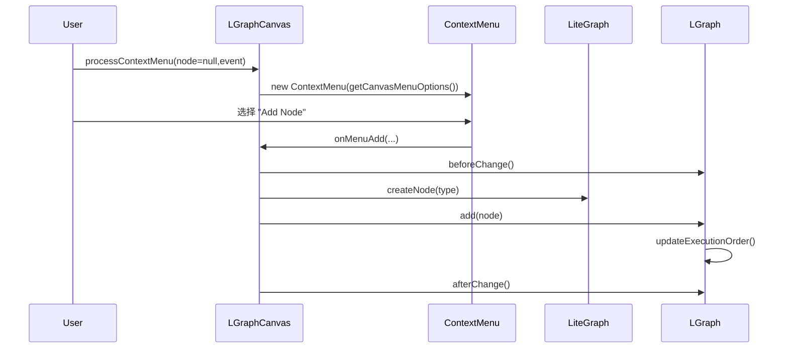

### 5.5 搜索框新增节点并自动连线

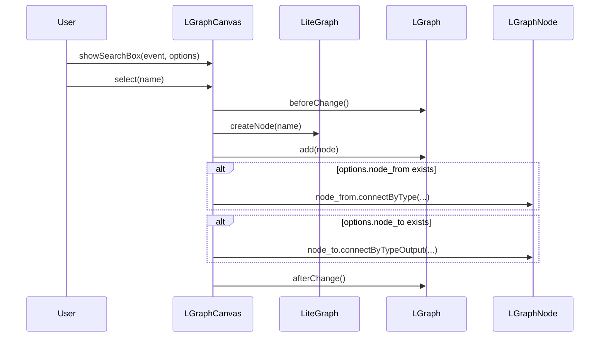

### 5.6 拖拽建立连线

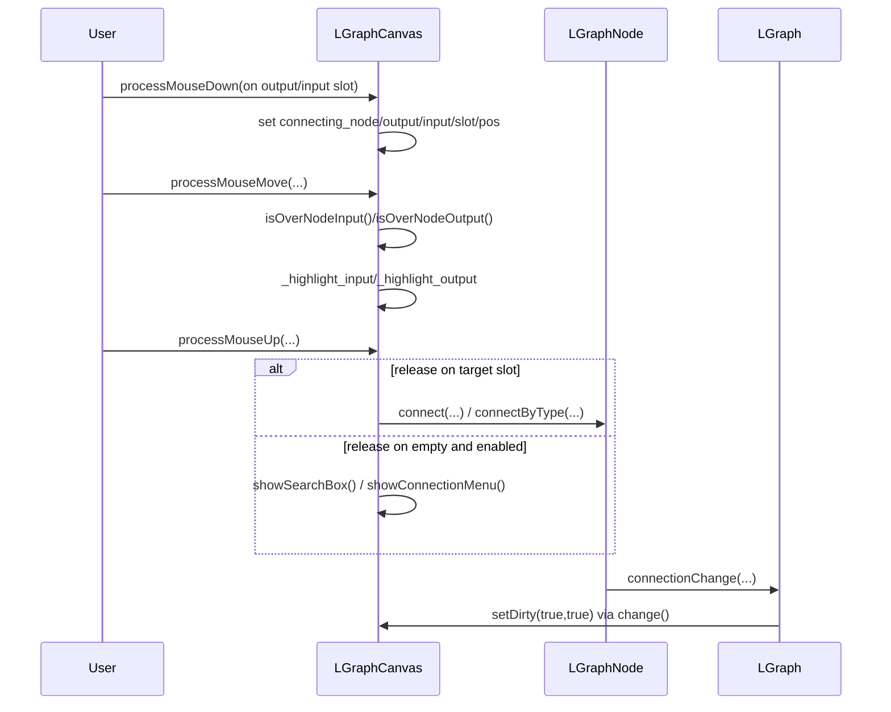

### 5.7 断开连线

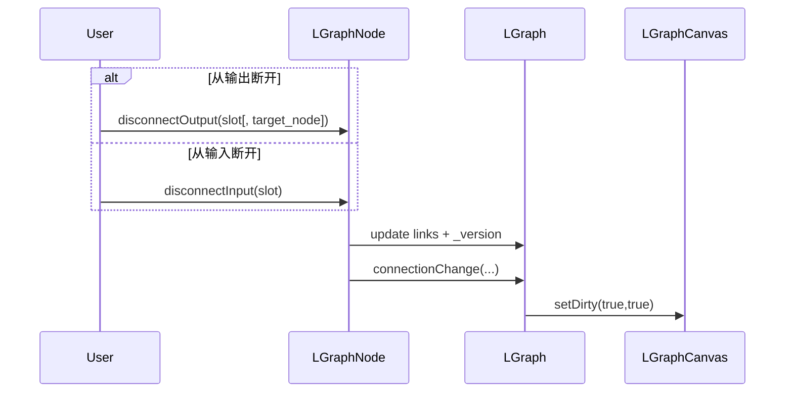

### 5.8 拖拽节点与落位

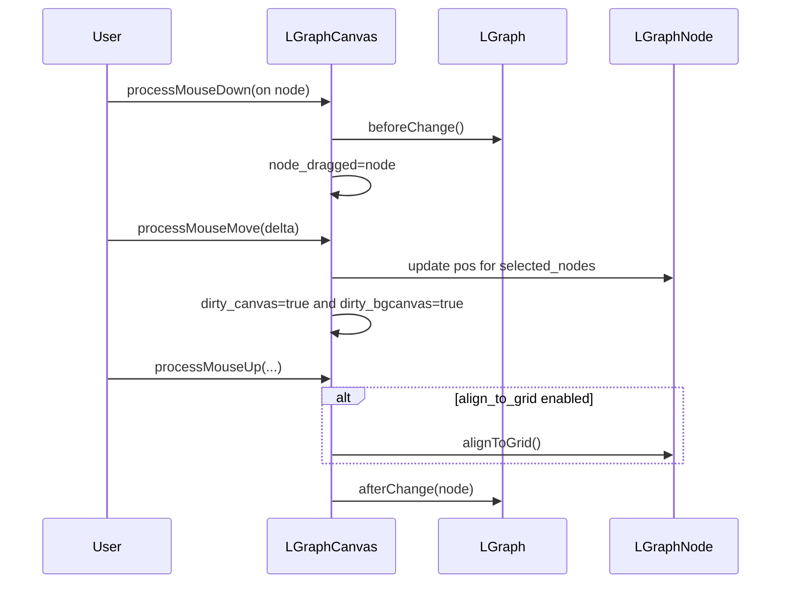

### 5.9 删除节点

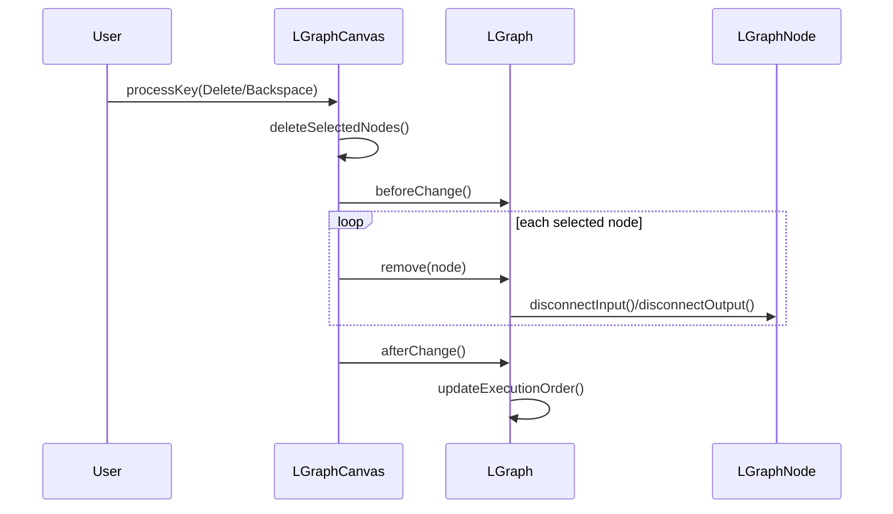

### 5.10 平移与缩放

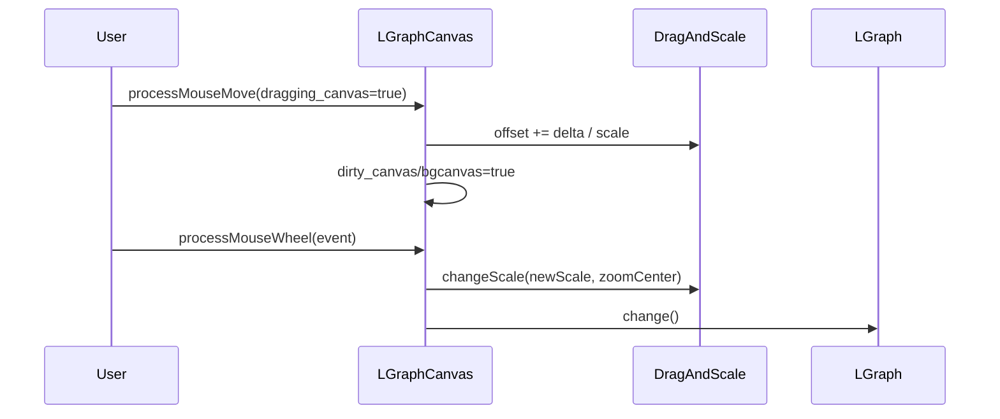

### 5.11 序列化与反序列化

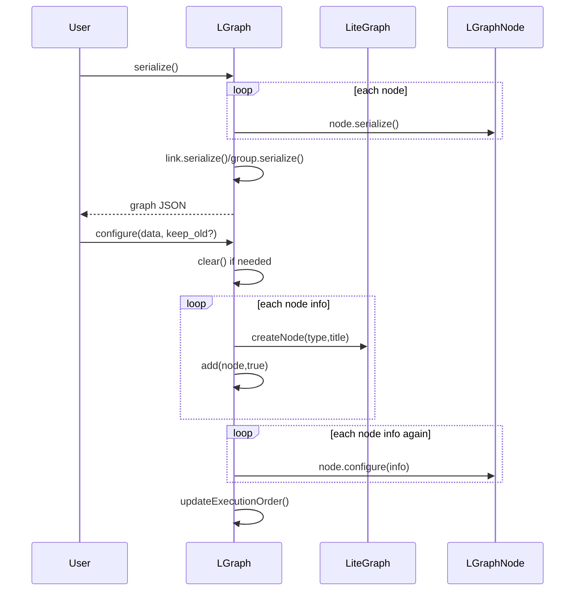

### 5.12 子图与控件交互

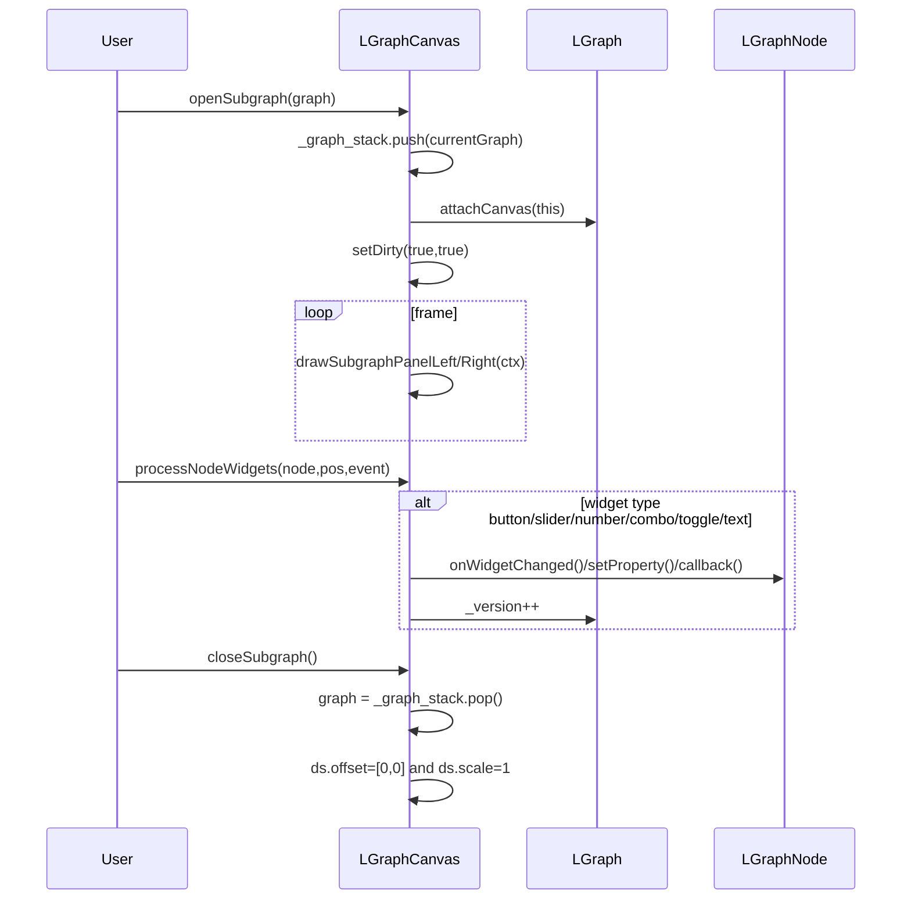

## 6. 关键状态字段与排障入口

### 6.1 渲染不更新

重点检查：

- `LGraphCanvas.is_rendering` 是否为 `true`
- `dirty_canvas/dirty_bgcanvas` 是否被置位
- `graph.change()` 是否被调用（它会广播 `setDirty(true,true)`）
- 是否被 `pause_rendering` 或 `skip_render` 禁用

建议跟踪函数：

- `LGraphCanvas.startRendering`
- `LGraphCanvas.draw`
- `LGraphCanvas.setDirty`
- `LGraph.change`

### 6.2 连接线异常

重点检查：

- `graph.links` 内 link 是否存在
- 输入槽 `input.link` 与输出槽 `output.links` 是否一致
- `LiteGraph.isValidConnection` 是否拒绝了类型
- `allow_multi_output_for_events` 是否导致事件输出单路限制

建议跟踪函数：

- `LGraphNode.connect`
- `LGraphNode.disconnectInput`
- `LGraphNode.disconnectOutput`
- `LGraph.connectionChange`
- `LGraphCanvas.drawConnections`

### 6.3 节点执行不触发

重点检查：

- `node.mode` 是否为 `LiteGraph.ALWAYS` / `LiteGraph.ON_TRIGGER`
- 是否在 `_nodes_executable` 中（`updateExecutionOrder` 是否执行）
- `onExecute` 是否存在
- 事件链是否走到 `triggerSlot`

建议跟踪函数：

- `LGraph.runStep`
- `LGraph.updateExecutionOrder`
- `LGraphNode.doExecute`
- `LGraphNode.triggerSlot`

### 6.4 交互错位（平移/缩放后点击不准）

重点检查：

- `adjustMouseEvent` 的 `canvasX/canvasY` 换算
- `DragAndScale.scale/offset` 与 `viewport` 是否同步
- 命中判断函数是否使用了正确坐标系：
  - `getNodeOnPos`
  - `isOverNodeInput`
  - `isOverNodeOutput`

## 7. 源码索引（函数 -> 文件行号）

> 说明：行号基于当前仓库版本，后续改动可能导致偏移。建议配合函数名检索。

| 角色         | 函数                                               | 位置                           |
| ------------ | -------------------------------------------------- | ------------------------------ |
| LiteGraph    | `createNode`                                     | `src/litegraph.js:476`       |
| LGraph       | `start`                                          | `src/litegraph.js:975`       |
| LGraph       | `runStep`                                        | `src/litegraph.js:1054`      |
| LGraph       | `add`                                            | `src/litegraph.js:1469`      |
| LGraph       | `remove`                                         | `src/litegraph.js:1548`      |
| LGraph       | `change`                                         | `src/litegraph.js:2149`      |
| LGraph       | `serialize`                                      | `src/litegraph.js:2185`      |
| LGraph       | `configure`                                      | `src/litegraph.js:2240`      |
| LGraphNode   | `doExecute`                                      | `src/litegraph.js:3222`      |
| LGraphNode   | `triggerSlot`                                    | `src/litegraph.js:3306`      |
| LGraphNode   | `connect`                                        | `src/litegraph.js:4293`      |
| LGraphNode   | `disconnectOutput`                               | `src/litegraph.js:4503`      |
| LGraphNode   | `disconnectInput`                                | `src/litegraph.js:4659`      |
| DragAndScale | `computeVisibleArea`                             | `src/litegraph.js:5131`      |
| DragAndScale | `changeScale`                                    | `src/litegraph.js:5257`      |
| LGraphCanvas | `constructor`                                    | `src/litegraph.js:5325`      |
| LGraphCanvas | `openSubgraph`                                   | `src/litegraph.js:5552`      |
| LGraphCanvas | `closeSubgraph`                                  | `src/litegraph.js:5581`      |
| LGraphCanvas | `setCanvas`                                      | `src/litegraph.js:5615`      |
| LGraphCanvas | `bindEvents`                                     | `src/litegraph.js:5700`      |
| LGraphCanvas | `startRendering`                                 | `src/litegraph.js:5881`      |
| LGraphCanvas | `processMouseDown`                               | `src/litegraph.js:5926`      |
| LGraphCanvas | `processMouseMove`                               | `src/litegraph.js:6423`      |
| LGraphCanvas | `processMouseUp`                                 | `src/litegraph.js:6680`      |
| LGraphCanvas | `draw`                                           | `src/litegraph.js:7814`      |
| LGraphCanvas | `drawFrontCanvas`                                | `src/litegraph.js:7851`      |
| LGraphCanvas | `drawBackCanvas`                                 | `src/litegraph.js:8351`      |
| LGraphCanvas | `drawConnections`                                | `src/litegraph.js:9360`      |
| LGraphCanvas | `renderLink`                                     | `src/litegraph.js:9494`      |
| LGraphCanvas | `processNodeWidgets`                             | `src/litegraph.js:10090`     |
| LGraphCanvas | `onMenuAdd`                                      | `src/litegraph.js:10592`     |
| LGraphCanvas | `showSearchBox`                                  | `src/litegraph.js:11508`     |
| Editor       | `graph.onAfterExecute -> graphcanvas.draw(true)` | `src/litegraph-editor.js:25` |

## 8. 开关分支速查

这些配置会显著影响你看到的交互和时序路径：

- `live_mode`：
  - 打开时节点渲染进入“内容优先”模式，很多编辑态 UI 不绘制
- `allow_reconnect_links`：
  - 决定点击输入端已有连接后是否可直接重连
- `release_link_on_empty_shows_menu`：
  - 决定连线释放到空白区域时是否弹创建/搜索菜单
- `ctrl_shift_v_paste_connect_unselected_outputs`：
  - 决定 `Ctrl+Shift+V` 粘贴时是否回接未选中输出
- `allow_multi_output_for_events`：
  - 事件输出是否允许多路并行输出

---

如果你在调试某个具体交互，建议先从对应时序图定位入口函数，再在源码里沿“状态字段变化点”打断点（尤其是 `dirty_*`、`connecting_*`、`graph.links`、`_nodes_executable`）。
